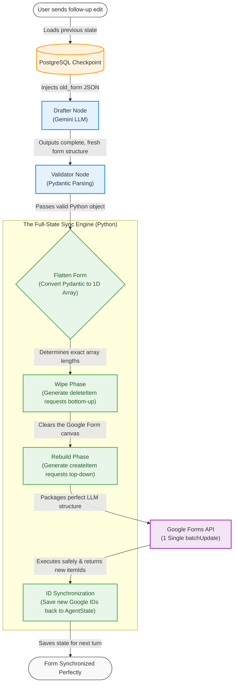

```mermaid
graph TD
    %% Nodes
    Start([User sends follow-up edit])
    DB[(PostgreSQL Checkpoint)]
    Drafter["Drafter Node\n(Gemini LLM)"]
    Validator["Validator Node\n(Pydantic Parsing)"]
    
    subgraph ReliableSync ["The Full-State Sync Engine (Python)"]
        Flatten{"Flatten Form\n(Convert Pydantic to 1D Array)"}
        DeleteLoop["Wipe Phase\n(Generate deleteItem requests bottom-up)"]
        CreateLoop["Rebuild Phase\n(Generate createItem requests top-down)"]
        IDRemap["ID Synchronization\n(Save new Google IDs back to AgentState)"]
    end
    
    API["Google Forms API\n(1 Single batchUpdate)"]
    End([Form Synchronized Perfectly])

    %% Flow
    Start -->|Loads previous state| DB
    DB -->|Injects old_form JSON| Drafter
    Drafter -->|Outputs complete, fresh form structure| Validator
    Validator -->|Passes valid Python object| Flatten
    
    Flatten -->|Determines exact array lengths| DeleteLoop
    DeleteLoop -->|Clears the Google Form canvas| CreateLoop
    CreateLoop -->|Packages perfect LLM structure| API
    
    API -->|Executes safely & returns new itemIds| IDRemap
    IDRemap -->|Saves state for next turn| End

    %% Styling
    classDef default fill:#f9f9f9,stroke:#333,stroke-width:1px;
    classDef db fill:#fff3e0,stroke:#ff9800,stroke-width:2px;
    classDef llm fill:#e3f2fd,stroke:#1e88e5,stroke-width:2px;
    classDef safe fill:#e8f5e9,stroke:#4caf50,stroke-width:2px,color:#1b5e20;
    classDef external fill:#f3e5f5,stroke:#9c27b0,stroke-width:2px;

    class DB db;
    class Drafter,Validator llm;
    class Flatten,DeleteLoop,CreateLoop,IDRemap safe;
    class API external;
```