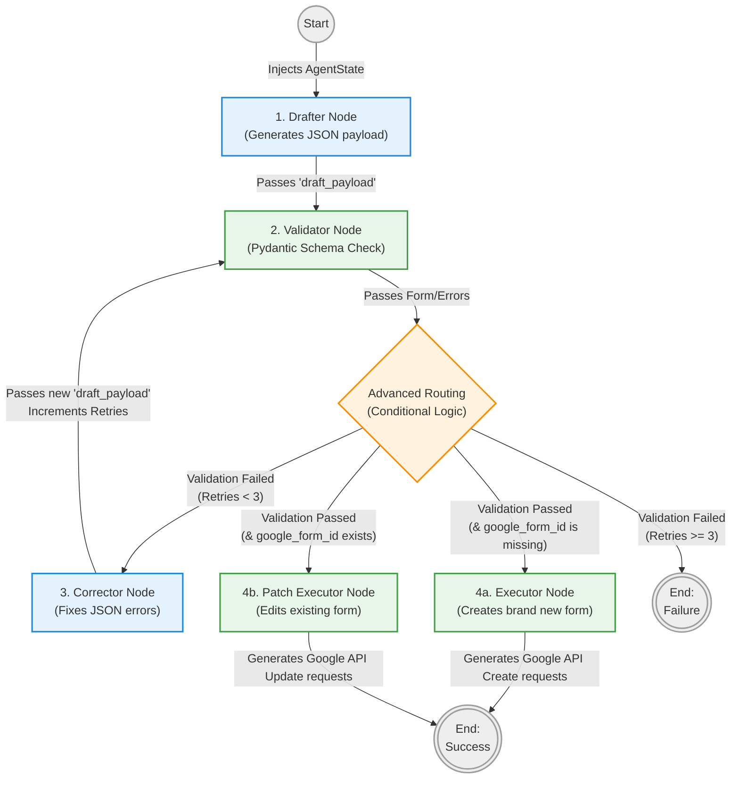

```mermaid
graph TD
    %% Nodes
    START((Start))
    Drafter["1. Drafter Node\n(Generates JSON payload)"]
    Validator["2. Validator Node\n(Pydantic Schema Check)"]
    Router{"Advanced Routing\n(Conditional Logic)"}
    Corrector["3. Corrector Node\n(Fixes JSON errors)"]
    Executor["4a. Executor Node\n(Creates brand new form)"]
    PatchExecutor["4b. Patch Executor Node\n(Edits existing form)"]
    END_SUCCESS(((End:\nSuccess)))
    END_FAILURE(((End:\nFailure)))

    %% Edges
    START -->|Injects AgentState| Drafter
    Drafter -->|Passes 'draft_payload'| Validator
    Validator -->|Passes Form/Errors| Router
    
    %% Routing Logic
    Router -- "Validation Failed\n(Retries < 3)" --> Corrector
    Corrector -->|Passes new 'draft_payload'\nIncrements Retries| Validator
    
    Router -- "Validation Failed\n(Retries >= 3)" --> END_FAILURE
    
    Router -- "Validation Passed\n(& google_form_id is missing)" --> Executor
    Router -- "Validation Passed\n(& google_form_id exists)" --> PatchExecutor
    
    Executor -->|Generates Google API Create requests| END_SUCCESS
    PatchExecutor -->|Generates Google API Update requests| END_SUCCESS

    %% Styling
    classDef ai_node fill:#e3f2fd,stroke:#1e88e5,stroke-width:2px;
    classDef tool_node fill:#e8f5e9,stroke:#43a047,stroke-width:2px;
    classDef logic_node fill:#fff3e0,stroke:#fb8c00,stroke-width:2px,shape:diamond;
    classDef terminal fill:#eeeeee,stroke:#9e9e9e,stroke-width:2px;

    class Drafter,Corrector ai_node;
    class Validator,Executor,PatchExecutor tool_node;
    class Router logic_node;
    class START,END_SUCCESS,END_FAILURE terminal;
```