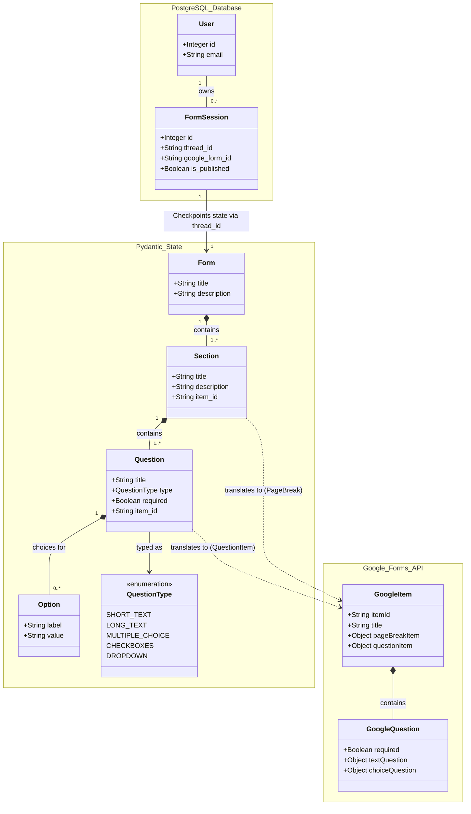

```mermaid
classDiagram
    direction TB

    %% Database Entities
    namespace PostgreSQL_Database {
        class User {
            +Integer id
            +String email
        }
        class FormSession {
            +Integer id
            +String thread_id
            +String google_form_id
            +Boolean is_published
        }
    }

    User "1" -- "0..*" FormSession : owns

    %% Pydantic Models (LLM Output)
    namespace Pydantic_State {
        class Form {
            +String title
            +String description
        }
        class Section {
            +String title
            +String description
            +String item_id
        }
        class Question {
            +String title
            +QuestionType type
            +Boolean required
            +String item_id
        }
        class Option {
            +String label
            +String value
        }
        class QuestionType {
            <<enumeration>>
            SHORT_TEXT
            LONG_TEXT
            MULTIPLE_CHOICE
            CHECKBOXES
            DROPDOWN
        }
    }

    FormSession "1" --> "1" Form : Checkpoints state via thread_id
    Form "1" *-- "1..*" Section : contains
    Section "1" *-- "1..*" Question : contains
    Question "1" *-- "0..*" Option : choices for
    Question --> QuestionType : typed as

    %% Google API Representation
    namespace Google_Forms_API {
        class GoogleItem {
            +String itemId
            +String title
            +Object pageBreakItem
            +Object questionItem
        }
        class GoogleQuestion {
            +Boolean required
            +Object textQuestion
            +Object choiceQuestion
        }
    }
    
    Section ..> GoogleItem : translates to (PageBreak)
    Question ..> GoogleItem : translates to (QuestionItem)
    GoogleItem *-- GoogleQuestion : contains
```