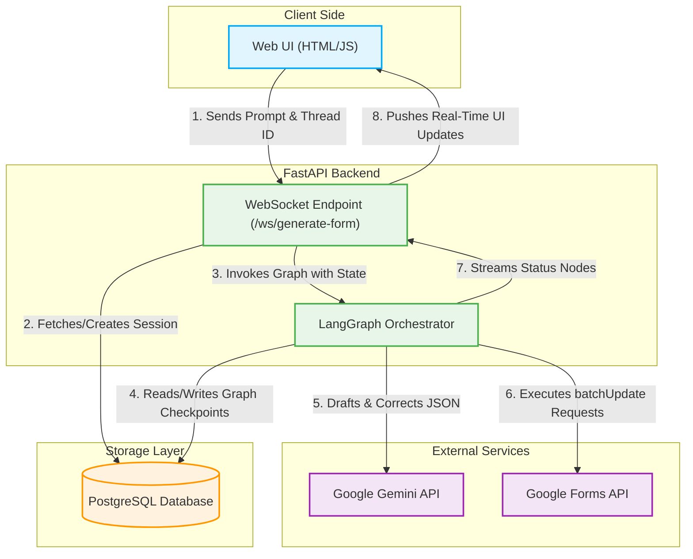

```mermaid
graph TD
    subgraph Client ["Client Side"]
        UI["Web UI (HTML/JS)"]
    end

    subgraph Backend ["FastAPI Backend"]
        WS["WebSocket Endpoint (/ws/generate-form)"]
        LG["LangGraph Orchestrator"]
    end

    subgraph Data ["Storage Layer"]
        PG[("PostgreSQL Database")]
    end

    subgraph External ["External Services"]
        Gemini["Google Gemini API"]
        GForms["Google Forms API"]
    end

    %% Data Flow Connections
    UI -- "1. Sends Prompt & Thread ID" --> WS
    WS -- "2. Fetches/Creates Session" --> PG
    WS -- "3. Invokes Graph with State" --> LG
    LG -- "4. Reads/Writes Graph Checkpoints" --> PG
    LG -- "5. Drafts & Corrects JSON" --> Gemini
    LG -- "6. Executes batchUpdate Requests" --> GForms
    LG -- "7. Streams Status Nodes" --> WS
    WS -- "8. Pushes Real-Time UI Updates" --> UI

    %% Styling
    classDef client fill:#e1f5fe,stroke:#03a9f4,stroke-width:2px;
    classDef backend fill:#e8f5e9,stroke:#4caf50,stroke-width:2px;
    classDef storage fill:#fff3e0,stroke:#ff9800,stroke-width:2px;
    classDef external fill:#f3e5f5,stroke:#9c27b0,stroke-width:2px;
    
    class UI client;
    class WS,LG backend;
    class PG storage;
    class Gemini,GForms external;
```